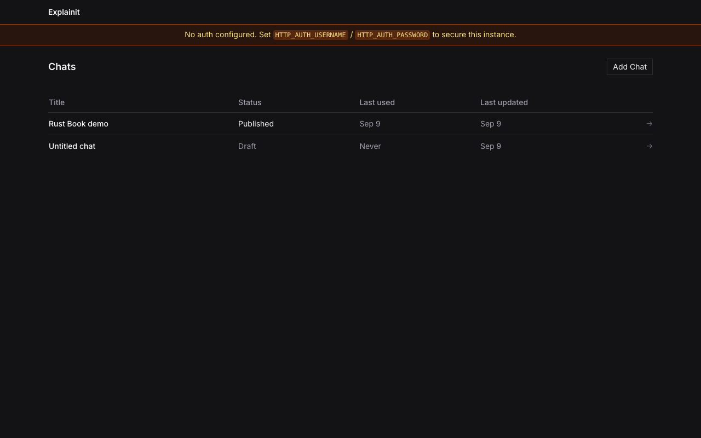
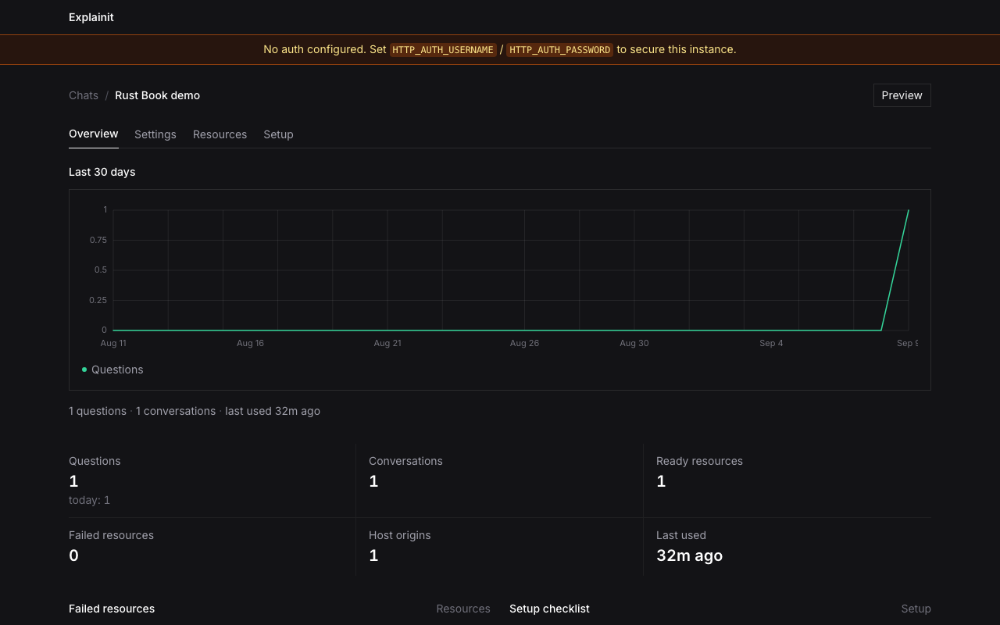
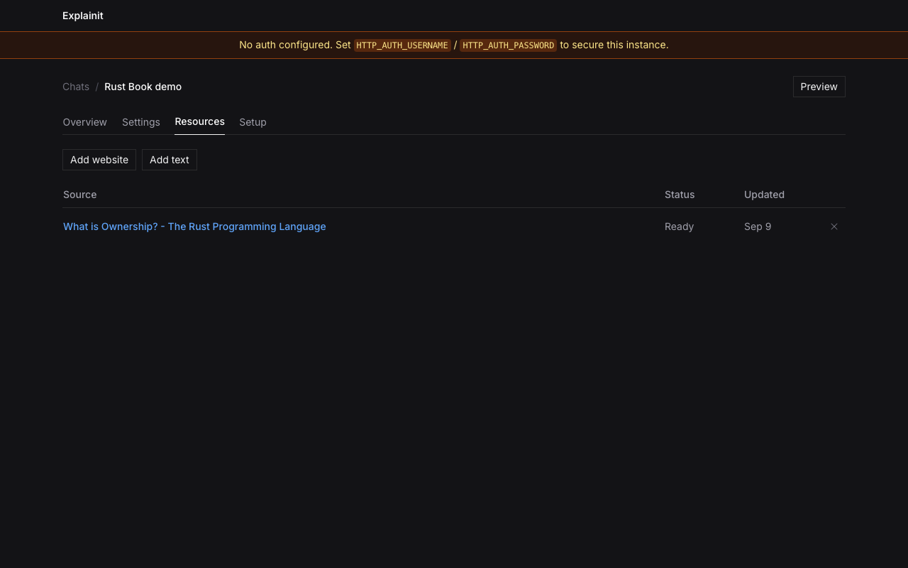
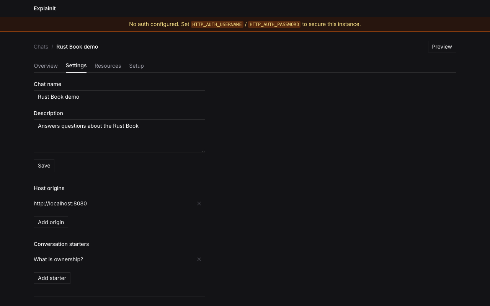
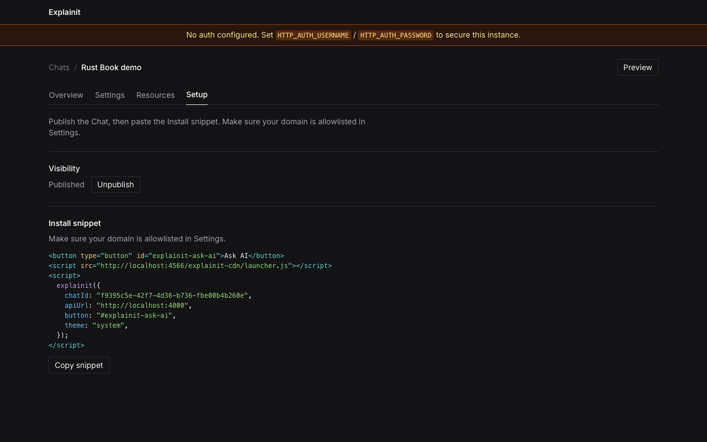
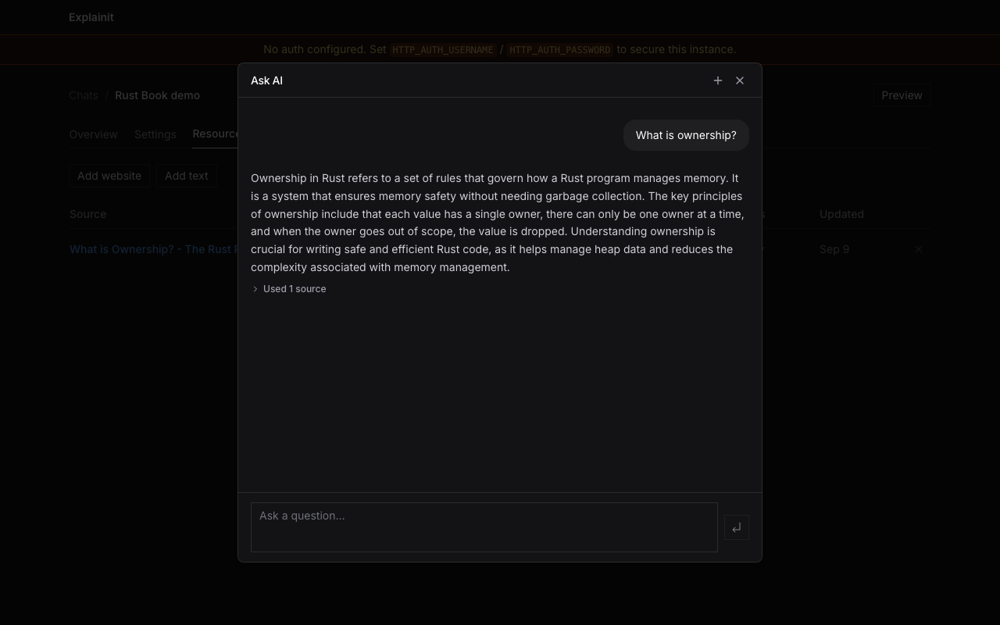
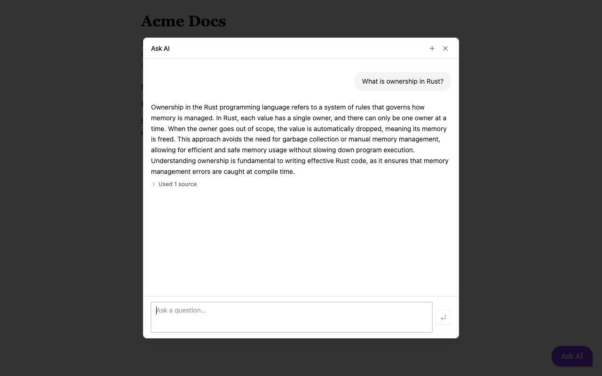

# Explainit

Explainit is a self-hosted Owner dashboard and Host-site Ask AI widget for documentation Q&A. Teams create Chats, crawl or paste their docs, then embed a launcher on any allowlisted origin so visitors get grounded answers from that corpus.

| Chats | Overview | Resources | Settings |
| --- | --- | --- | --- |
|  |  |  |  |

| Setup | Preview | Host launcher |
| --- | --- | --- |
|  |  |  |

## Features

- Owner dashboard for Chats, resources, settings, and setup
- Website crawl / single-page ingest plus pasted text resources
- Host launcher (`explainit({ chatId, apiUrl, button, theme })`) that mounts Host Chat in a ShadowRoot
- Origin allowlist for visitor API access
- Local Docker Compose for full-stack development
- Production Compose stack for self-hosting on one machine

## Running your own Explainit instance

The easiest way to self-host is Docker Compose (dashboard, visitor API, and launcher on one origin):

```bash
cd deploy/compose
cp .env.example .env
# set PUBLIC_URL, OPENROUTER_API_KEY, HTTP_AUTH_USERNAME, HTTP_AUTH_PASSWORD, AUTH_SECRET
docker compose up -d
```

Open `PUBLIC_URL` (default `http://localhost`) and sign in. Full configuration, TLS, backups, and upgrades: [Docker deployment docs](docs/docker-deployment.md).

Images: `ghcr.io/matzapata/explainit-server` and `ghcr.io/matzapata/explainit-client` (or `docker compose up --build` from this repo).

## Documentation

- [Architecture](docs/architecture.md)
- [Docker deployment (self-host)](docs/docker-deployment.md)
- [Contributing and local workflows](CONTRIBUTING.md)

To regenerate README stills: run the root Compose stack, serve `packages/launcher/example` on `:8080`, then capture the Owner tabs + Preview + Host widget with Playwright (one-shot; not a committed test suite).

## Contributing

Contributions are welcome. Please read [CONTRIBUTING.md](CONTRIBUTING.md) and [CODE_OF_CONDUCT.md](CODE_OF_CONDUCT.md) before opening issues or pull requests.

## License

This project is licensed under the MIT License. See [LICENSE](LICENSE) for details.
