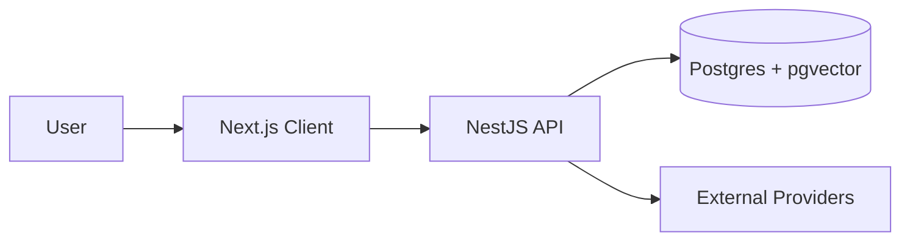
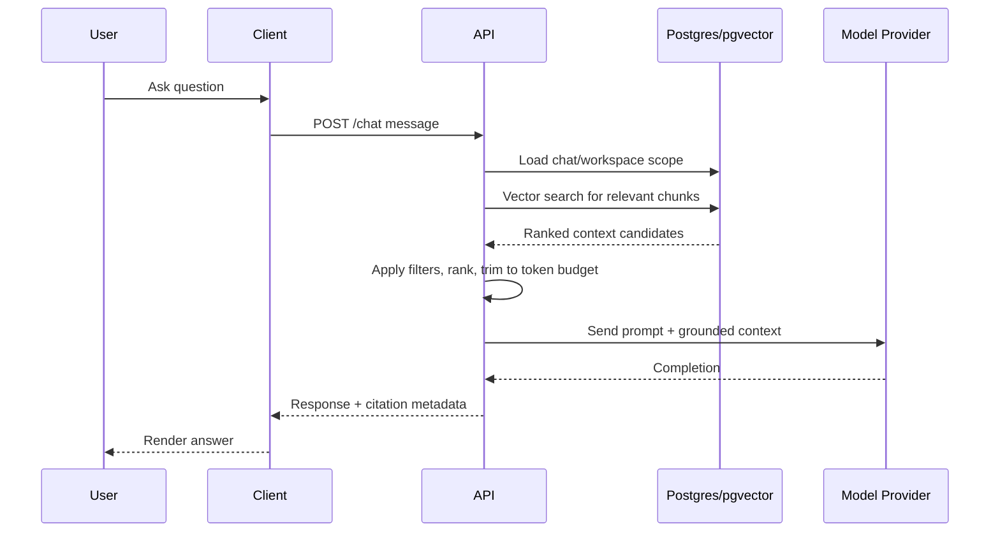

# Architecture

Explainit uses a three-layer Retrieval-Augmented Generation (RAG) architecture:

1. `client` (Next.js) for user interaction
2. `server` (NestJS) for orchestration and policy
3. `postgres` (Postgres + pgvector) for transactional and semantic data

External providers supply language model inference, embedding generation, and optional storage integrations.

## System context

- `client`: chat UX, workspace/resource setup, and response rendering
- `server`: auth, ingestion pipeline, retrieval, prompt assembly, and response generation
- `postgres`: source records, chats/messages, chunk metadata, and vector indexes
- Providers: model APIs and other environment-configured dependencies



## Server infrastructure layer

`apps/server/src/infrastructure` follows a provider-selection pattern:

- Each domain has a `<domain>.module.ts` Nest module.
- A `<domain>.service.ts` file re-exports the active provider implementation.
- `providers/` contains abstract contracts and one or more concrete adapters.

Current infrastructure folders and responsibilities:

- `auth`: token verification via JWKS-backed provider (`JwksProvider`)
- `crawler`: website crawling/scraping and URL inspection (`PuppeteerCrawlerProvider`)
- `embeddings`: embedding generation abstraction (`OpenAiEmbeddingsProvider`)
- `llm`: text generation model binding (`OpenAILlmProvider`)
- `vectorstore`: vector add/search/delete over Postgres + pgvector (`PrismaVectorStoreProvider`)
- `storage`: file/object storage and image resize (`GcpStorageProvider`)
- `emails`: transactional email delivery (`ResendEmailProvider`, optional NodeMailer provider)
- `payments`: subscriptions, checkout, and webhooks (`LemonSqueezyPaymentProvider`)

## Architecture goals

- Ground answers in ingested project content, not only model pretraining
- Keep end-user latency low for interactive chat workloads
- Preserve source traceability so responses can be audited and trusted
- Minimize operational complexity for the current product stage
- Allow independent evolution of UI, orchestration logic, and storage strategy

## Why this shape works

- **Separation of concerns**
  - `client` optimizes UX and perceived latency
  - `server` centralizes retrieval logic, policy enforcement, and provider coordination
  - `postgres` is the source of truth for both business entities and embeddings
- **Grounded generation**
  - Retrieved chunks are attached to each model call, reducing hallucination risk
  - Source metadata can be surfaced as citations in final answers
- **Single-datastore operations**
  - pgvector keeps semantic retrieval close to relational data and metadata filters
  - Fewer moving pieces than introducing an additional vector service early

## Request lifecycle (chat path)



## Ingestion lifecycle (indexing path)

```mermaid
flowchart TD
  Source[Source URL or content] --> Fetch[Fetch and normalize content]
  Fetch --> Crawl[Crawler provider (inspect/crawl/scrape)]
  Crawl --> Chunk[Split content into chunks]
  Chunk --> Embed[Embeddings provider]
  Embed --> Store[Persist metadata + vectors in Postgres]
  Store --> Ready[Ready for retrieval]
```

Ingestion is intentionally decoupled from chat-time generation so indexing failures degrade freshness rather than total availability.

### Crawler infrastructure

Crawler responsibilities are implemented under `apps/server/src/infrastructure/crawler`:

- `CrawlerProvider` defines three capabilities:
  - `inspect`: discover in-domain URLs from a seed page
  - `crawl`: recursively collect HTML pages up to `maxRequests`
  - `scrape`: fetch and extract specific URL lists
- Active implementation uses Puppeteer with headless Chromium.
- Output contract (`ScrapeResult`) includes `url`, `title`, and raw `html`.

This design keeps crawling provider-specific details isolated while exposing a stable API to ingestion use-cases.

### Embeddings infrastructure

Embedding responsibilities are implemented under `apps/server/src/infrastructure/embeddings`:

- `EmbeddingsProvider` contract exposes `generateEmbeddings(text: string)`.
- Active implementation (`OpenAiEmbeddingsProvider`) uses `@langchain/openai`.
- Text is normalized before embedding (newlines replaced with spaces).
- The same service is reused by vector ingestion (`addDocuments`) and query-time similarity search.

This keeps embedding-model changes isolated to the infrastructure layer without changing retrieval business logic.

## Retrieval design

An embedding is a dense numeric representation where semantically related text is nearby in vector space. Explainit computes:

- chunk embeddings during ingestion
- query embeddings during chat requests

### Why embeddings

- Handles paraphrasing better than pure keyword matching
- Improves recall when users use different wording from source documents
- Enables relevance ranking by semantic intent

### Why pgvector

- Supports efficient nearest-neighbor search over high-dimensional vectors
- Allows SQL-native filtering (`namespace` is the chat id) next to relational rows
- Reduces operational overhead at current scale compared to a separate vector tier

### Retrieval pipeline

1. Embed user query text (OpenAI `text-embedding-ada-002`, 1536 dimensions)
2. Fetch top-k chunks with cosine distance (`ORDER BY embedding <=> $query`)
3. Scope results with `WHERE namespace = chat_id`
4. Trim to model token budget and build a grounded prompt

`PrismaVectorStoreProvider` writes and searches vectors through `$executeRaw` / `$queryRaw`. An HNSW index (`vector_cosine_ops`) backs kNN. Prisma does not model `vector` natively; the column is `Unsupported("vector(1536)")`.

## Data model notes

- **User**: `id` UUID, unique `email`, optional `name`
- **Chat**: belongs to a user (`ownerId`); metadata, conversation starters, published flag, points
- **ChatResource**: belongs to a chat; stores source type/data and `embeddingIds` for the chunks it produced
- **Embedding**: chunk `content`, `namespace` (chat id), JSON `metadata` (source URL/title), `vector(1536)`
- **ChatRateLimit**: per-chat message throttle rows
- **UserSubscription** / **WebhookEvent**: payment records (still present until payments are stripped)

Primary keys are UUID. There is no Mongo/Atlas dependency.

## Reliability and observability

- Each stage should emit structured logs: fetch, parse, chunk, embed, store, retrieve, generate
- Distinguish transient provider failures (retryable) from deterministic content failures (non-retryable)
- Maintain metrics for:
  - chat request latency (p50/p95/p99)
  - retrieval hit quality (e.g., similarity score distribution)
  - provider error rates and timeouts
  - ingestion throughput and failure counts
- Validate deployments with end-to-end smoke tests for ingestion and Q&A

## Security and tenancy boundaries

- Enforce chat ownership and namespace scoping in all retrieval queries
- Never trust client-supplied scope without server-side validation
- Keep provider credentials in environment-managed secrets
- Redact sensitive fields from logs and telemetry payloads

## Key tradeoffs and tuning knobs

- **Postgres + pgvector vs dedicated vector database**
  - Current choice favors simplicity and tight metadata joins
  - Revisit when corpus size, concurrency, or latency targets exceed limits
- **Chunk size and overlap**
  - Smaller chunks increase precision; larger chunks preserve context
  - Overlap improves continuity but increases index size and retrieval cost
- **Top-k and context window allocation**
  - Larger k improves recall but increases latency and token spend
  - Practical tuning balances answer quality against response time and cost
- **Prompt strictness**
  - Strong grounding instructions improve factuality
  - Over-constrained prompts can reduce fluency or useful synthesis

## Evolution path

Likely future upgrades as load and corpus size grow:

- Background queues/workers for ingestion retries and backpressure control
- Caching layers for hot retrieval results or prompt scaffolds
- Hybrid retrieval (keyword + semantic + reranker)
- Optional move to a dedicated vector service if pgvector no longer meets SLOs

