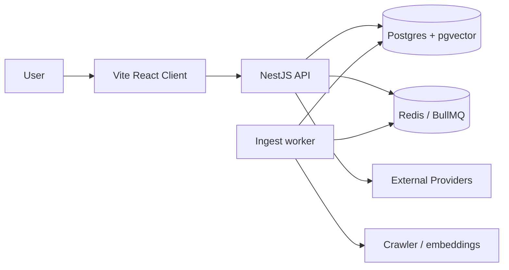
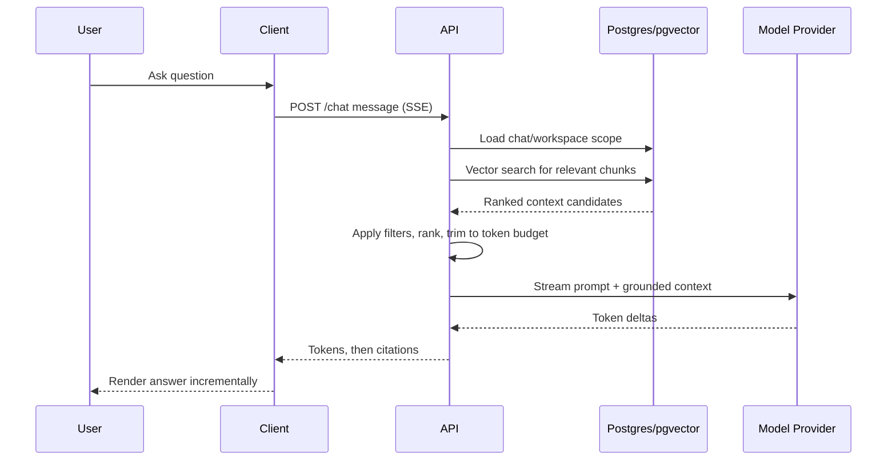
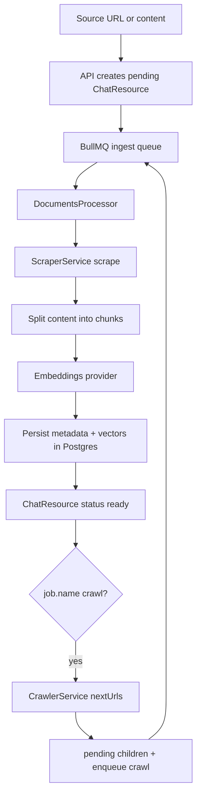

# Architecture

Explainit uses a three-layer Retrieval-Augmented Generation (RAG) architecture:

1. `client` (Vite + React) for the Owner dashboard
2. `server` (NestJS) for orchestration and policy
3. `postgres` (Postgres + pgvector) for transactional and semantic data

The **Launcher** (`packages/launcher`) is a vanilla IIFE on a CDN. Host sites call `explainit({ chatId, apiUrl, button, theme })` with a Host-owned control; `theme` is `light` | `dark` | `system`. On click it mounts **Host Chat** (`packages/host-chat`) — the default Ask AI UI — into a ShadowRoot. Custom UIs can call the same JSON visitor endpoints without that widget.

External providers supply language model inference, embedding generation, and optional storage integrations.

## System context

- `client`: Owner dashboard — workspace/resource setup, Preview (imports Host Chat UI)
- `launcher`: vanilla CDN IIFE that opens Ask AI in a ShadowRoot (`explainit({ chatId, apiUrl, button, theme })`)
- `host-chat`: React Ask AI UI shared by dashboard Preview/`/chat/:id` and the CDN `widget.js`/`widget.css`
- `server` API: auth, enqueue ingest jobs, retrieval, prompt assembly, and response generation; visitor routes allowlist `Origin` against `Chat.hostOrigins`
- `server` worker: BullMQ processor that scrapes, chunks, and embeds website resources
- `postgres`: source records, chats/messages, chunk metadata, and vector indexes
- `redis`: BullMQ job queue and rate-limit counters
- Providers: model APIs and other environment-configured dependencies

## Server infrastructure layer

`apps/server/src/infra` follows a provider-selection pattern:

- Each domain has a `<domain>.module.ts` Nest module.
- A `<domain>.service.ts` file re-exports the active provider implementation.
- `providers/` contains abstract contracts and one or more concrete adapters.

HTTP controllers live in `infra/http/controllers` with request/response DTOs in `controllers/dto`. Use-cases live in `modules/{chat,documents,user}` (service + repository at the module root). Environment is validated with Zod (`infra/env`).

Current infrastructure folders and responsibilities:

- `auth`: password login when `HTTP_AUTH_USERNAME` and `HTTP_AUTH_PASSWORD` are set (`PasswordProvider` issues/verifies a local HS256 JWT); otherwise `NoneProvider` bootstraps an unsecured local owner
- `scraper`: fetch one URL to HTML (`PuppeteerScraperProvider`; swappable later for Firecrawl etc.)
- `crawler`: pure link policy — `nextUrls({ html, pageUrl, seedUrl })` with no HTTP
- `worker`: BullMQ processor(s) — the queue-transport counterpart to `infra/http` controllers, wired only into the worker process
- `llm`: chat model and embeddings via OpenRouter (`OpenRouterLlmProvider` uses LangChain `ChatOpenRouter`; `OpenRouterEmbeddingsProvider` calls OpenRouter `/embeddings`)
- `vector-store`: vector add/search/delete over Postgres + pgvector (`PgVectorProvider`)
- `object-storage`: object storage and image resize (`S3StorageProvider`; Floci in Compose, real S3/MinIO in production). Compose `floci-init` creates the document bucket and `explainit-cdn`; the `launcher` and `host-chat` one-shots upload `launcher.js` and `widget.js`/`widget.css`. Text resources upload public markdown under `resources/{chatId}/{id}.md`.
- `redis`: shared ioredis client. BullMQ keeps its own Redis connection.
- `rate-limiter`: Redis-backed `consume()` used by HTTP inbound limits (and later outbound providers)

## Architecture goals

- Ground answers in ingested project content, not only model pretraining
- Keep end-user latency low for interactive chat workloads
- Preserve source traceability so responses can be audited and trusted
- Minimize operational complexity for the current product stage
- Allow independent evolution of UI, orchestration logic, and storage strategy

## Why this shape works

- **Separation of concerns**
  - `client` is the Owner dashboard
  - `host-chat` is Visitor Ask AI (Preview, `/chat/:id`, and the Host-site widget)
  - `launcher` is the vanilla Host-site bootstrap
  - `server` centralizes retrieval logic, policy enforcement, and provider coordination
  - `postgres` is the source of truth for both business entities and embeddings
- **Grounded generation**
  - Retrieved chunks are attached to each model call, reducing hallucination risk
  - Source metadata can be surfaced as citations in final answers
- **Single-datastore operations**
  - pgvector keeps semantic retrieval close to relational data and metadata filters
  - Fewer moving pieces than introducing an additional vector service early

## Request lifecycle (chat path)

## Ingestion lifecycle (indexing path)

Ingestion is intentionally decoupled from chat-time generation so indexing failures degrade freshness rather than total availability. Website ingest is asynchronous:

- `POST /api/chats/:id/resources/web` enqueues one scrape job per URL (`name: website`) and returns `202` with `pending` resources.
- `POST /api/chats/:id/resources/web/crawl` creates a seed pending resource (with a shared `crawlId`) and enqueues a crawl job (`name: crawl`, depth 0). After indexing, the worker may create more pending resources and enqueue further crawl jobs (same host, path prefix of the seed). Default budget is max depth 4 / max 50 website resources per Chat. Optional `unlimited: true` raises the budget to a hidden safety ceiling (depth 16 / 500 pages).
- Every ingest job uses a stable BullMQ `jobId` of `ingest:{resourceId}` so delete can remove waiting work without scanning the queue.
- `DELETE /api/chats/:id/resources/:resource_id` cancels work: a single-page pending/processing row removes that job then deletes the row; an inflight crawl row sets `ingest:cancelled:{crawlId}` (24h TTL), removes jobs and deletes all pending/processing siblings with that `crawlId`, and leaves ready/failed pages. An already-running Chromium job is cooperative — it finishes or hits the existing “resource gone” checks and discards embeddings.
- Deleting a chat also removes ingest jobs for its resources before clearing the embedding namespace.

`DocumentsProcessor` (`modules/documents/documents.processor.ts`) scrapes, chunks, embeds, and marks the row `ready` or `failed`. The API never launches Chromium. Text resources are still ingested inline.

### Queue infrastructure

Queue wiring follows the NestJS BullMQ sample (`@nestjs/bullmq`), split across the two process roots:

- `AppModule` and `WorkerModule` each call `BullModule.forRootAsync` with the same Redis connection config (`REDIS_HOST` / `REDIS_PORT`).
- `modules/documents/ingest-job.ts` owns the queue contract (`INGEST_QUEUE` name + `ScrapeJob` / `CrawlJob` payloads + job id / cancel-key helpers), since it's part of the ingestion use case, not generic infra. `DocumentsModule` calls `BullModule.registerQueue({ name: INGEST_QUEUE, defaultJobOptions: … })`.
- `DocumentsService` (producer) injects `Queue` with `@InjectQueue(INGEST_QUEUE)` and calls `add`/`addBulk` with `jobId: ingest:{resourceId}`. Payload is `{ resourceId, chatId, url }` (plus crawl budget fields and `crawlId`) — never HTML.
- `modules/documents/documents.processor.ts` (`@Processor(INGEST_QUEUE)`) is the queue-transport adapter — the consumer-side equivalent of an HTTP controller. It is declared only in `WorkerModule.providers`, never in the shared `ChatModule`, so Chromium ingest cannot run inside the API process. `name: crawl` → `processCrawl`; otherwise → `process`. Crawl fan-out checks the cancel key before creating children.
- Jobs retry 3 times with exponential backoff (`defaultJobOptions`). Permanent failures (`PermanentIngestError`) are marked `failed` and not retried. `ChatResource.status` remains the idempotency key.
- Compose runs Redis. `infra/main-worker.ts` is a separate Nest application context. Concurrency is 1 (one Chromium session). Lock duration is 5 minutes to cover scrape + embed.

### Scraper and crawler infrastructure

- **Scraper** (`apps/server/src/infra/scraper`): `ScraperProvider.scrape({ url })` returns `{ url, title, html }`. Active adapter is Puppeteer; a future Firecrawl (or similar) adapter should keep the same HTML contract so crawl can extract links.
- **Crawler** (`apps/server/src/infra/crawler`): pure policy, no HTTP. `CrawlerService.nextUrls({ html, pageUrl, seedUrl })` resolves links, keeps same-host / seed-path URLs, strips hashes, skips assets, and dedupes.
- Documents orchestrates both: scrape jobs ignore links; crawl jobs call `nextUrls` after a successful ingest and fan out within budget (and only while the crawl is not cancelled).

### Embeddings infrastructure

Embedding responsibilities are implemented under `apps/server/src/infra/llm`:

- `EmbeddingsProvider` contract exposes `generateEmbeddings(text: string)`.
- Active implementation (`OpenRouterEmbeddingsProvider`) POSTs to OpenRouter `/embeddings`. `OPENROUTER_EMBEDDING_MODEL` must remain 1536 dimensions.
- Text is normalized before embedding (newlines replaced with spaces).
- The same service is reused by vector ingestion (`addDocuments`) and query-time similarity search.

This keeps embedding-model changes isolated to the infrastructure layer without changing retrieval business logic.

## Retrieval design

An embedding is a dense numeric representation where semantically related text is nearby in vector space. Explainit computes:

- chunk embeddings during ingestion
- query embeddings during chat requests

### Why embeddings

- Handles paraphrasing better than pure keyword matching
- Improves recall when users use different wording from source documents
- Enables relevance ranking by semantic intent

### Why pgvector

- Supports efficient nearest-neighbor search over high-dimensional vectors
- Allows SQL-native filtering (`namespace` is the chat id) next to relational rows
- Reduces operational overhead at current scale compared to a separate vector tier

### Retrieval pipeline

1. Embed user query text (`openai/text-embedding-ada-002` via OpenRouter, 1536 dimensions)
2. Fetch top-k chunks with cosine distance (`ORDER BY embedding <=> $query`)
3. Scope results with `WHERE namespace = chat_id`
4. Trim to model token budget and build a grounded prompt

`PgVectorProvider` writes and searches vectors through Prisma `$executeRaw` / `$queryRaw`. An HNSW index (`vector_cosine_ops`) backs kNN. Prisma does not model `vector` natively; the column is `Unsupported("vector(1536)")`.

## Data model notes

- **User**: `id` UUID, unique `email`, optional `name`
- **Chat**: belongs to a user (`ownerId`); metadata, conversation starters, published flag, points; `hostOrigins` for visitor Origin allowlisting
- **ChatResource**: belongs to a chat; stores source type/data, `status` (`pending` / `processing` / `ready` / `failed`), optional `error`, optional `crawlId` (shared across pages from one crawl campaign), and `embeddingIds` for the chunks it produced
- **Embedding**: chunk `content`, `namespace` (chat id), JSON `metadata` (source URL/title), `vector(1536)`

Primary keys are UUID. There is no Mongo/Atlas dependency.

## Reliability and observability

The API emits the three observability signals used in Compose:

- **Traces** — OpenTelemetry SDK (`infra/observability/tracing.ts`) exports OTLP/HTTP to Jaeger. HTTP auto-instrumentation creates the root span; `@Span()` on ingest, retrieve, and generate adds child spans. `/health` and `/metrics` are not traced.
- **Logs** — Pino injects `traceId` / `spanId` from the active span. Auth cookies and authorization headers are redacted.
- **Metrics** — Prometheus scrapes `/metrics`. Grafana is provisioned with Prometheus and Jaeger datasources (`admin` / `admin` on port 3001 so it does not collide with the Vite client).

Distinguish transient provider failures (retryable) from deterministic content failures (non-retryable). Validate deployments with end-to-end smoke tests for ingestion and Q&A.

## Security and tenancy boundaries

- Enforce chat ownership and namespace scoping in all retrieval queries
- Never trust client-supplied scope without server-side validation
- Visitor `GET /api/chats/:id` and `POST …/messages` require a browser `Origin` (or `Referer`) that matches any `Chat.hostOrigins` entry or a dashboard `CORS_ORIGIN`
- Keep provider credentials in environment-managed secrets
- Redact sensitive fields from logs and telemetry payloads

## Key tradeoffs and tuning knobs

- **Postgres + pgvector vs dedicated vector database**
  - Current choice favors simplicity and tight metadata joins
  - Revisit when corpus size, concurrency, or latency targets exceed limits
- **Chunk size and overlap**
  - Smaller chunks increase precision; larger chunks preserve context
  - Overlap improves continuity but increases index size and retrieval cost
- **Top-k and context window allocation**
  - Larger k improves recall but increases latency and token spend
  - Practical tuning balances answer quality against response time and cost
- **Prompt strictness**
  - Strong grounding instructions improve factuality
  - Over-constrained prompts can reduce fluency or useful synthesis

## Evolution path

Likely future upgrades as load and corpus size grow:

- Caching layers for hot retrieval results or prompt scaffolds
- Hybrid retrieval (keyword + semantic + reranker)
- Optional move to a dedicated vector service if pgvector no longer meets SLOs

