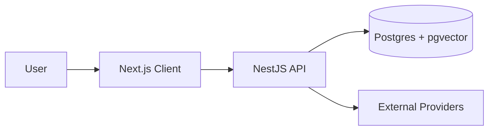
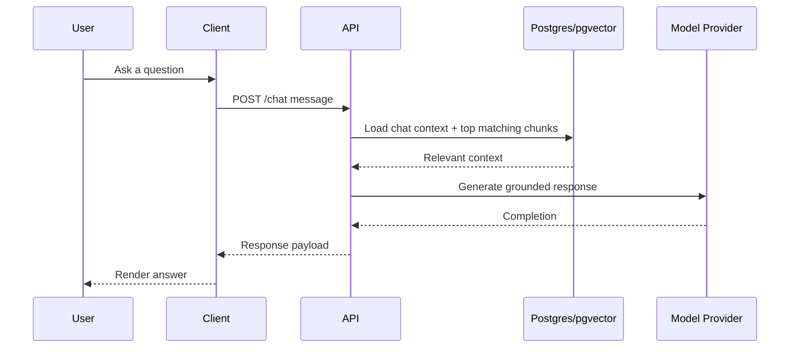
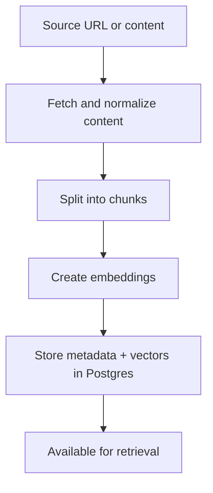

# Architecture

Explainit is organized as a web client, an API layer, and a Postgres datastore with vector search support.

## System context

- `client`: Next.js UI for chat, workspace setup, and resource management
- `server`: NestJS API for auth, ingestion, retrieval orchestration, and chat responses
- `postgres`: relational data + pgvector embeddings for semantic retrieval
- External providers: model APIs, storage, and other integrations configured by environment variables

## Why this architecture

This project is built as a Retrieval-Augmented Generation (RAG) system. The core goal is to generate answers grounded in project documentation instead of relying only on model pretraining.

- Separation of concerns keeps iteration fast:
  - `client` focuses on UX and interaction latency
  - `server` handles orchestration, retrieval, and policy
  - `postgres` stores both transactional records and semantic indexes
- RAG reduces hallucinations by attaching relevant source context to each model call.
- Keeping vectors in Postgres (via pgvector) simplifies operations: one datastore for both app data and semantic search.

## Request lifecycle

## Embeddings and vector search

An embedding is a dense numeric representation of text where semantically similar text appears close in vector space. Explainit generates embeddings for document chunks at ingestion time and embeddings for user queries at request time.

### Why embeddings are used

- Keyword search is brittle for paraphrased questions.
- Embeddings support semantic matching (intent similarity rather than literal term overlap).
- The system can retrieve useful context even when user wording differs from source docs.

### Why a vector database (pgvector)

- Fast approximate nearest-neighbor search over high-dimensional vectors.
- SQL-native filtering lets retrieval combine semantic similarity with metadata constraints.
- Operationally simpler than running a separate vector service for this project size and stage.

### Typical retrieval pattern

1. Embed the incoming user query.
2. Run vector similarity search to get top-k chunks.
3. Apply metadata guards (workspace/chat/resource constraints).
4. Rank and trim context to fit model token budget.
5. Send prompt + retrieved context to the model provider.

## Ingestion flow

## Data model notes

- Relational tables hold workspaces, chats, resources, and chunk metadata.
- Vector columns store chunk embeddings used for semantic retrieval.
- Metadata references allow traceable citations from responses back to original sources.

## Design tradeoffs and decisions

- **Postgres + pgvector vs dedicated vector DB**
  - Chosen for lower operational overhead and tighter integration with existing relational data.
  - Can be revisited if corpus size or query QPS outgrows current performance envelope.
- **Chunk size and overlap**
  - Smaller chunks improve precision but can lose context.
  - Overlap improves continuity but increases storage and retrieval cost.
- **Top-k retrieval**
  - Larger k improves recall but adds latency and token cost.
  - Practical tuning balances answer quality with response time.
- **Grounded prompting**
  - Retrieved context is preferred over unrestricted generation to improve factuality and trust.

## Reliability and observability

- Ingestion is separated from chat-time retrieval so indexing failures do not block all interactions.
- Critical stages (fetch, chunk, embed, store, retrieve, generate) should emit structured logs for diagnosis.
- Deployment validation should include end-to-end smoke tests for ingestion and question answering.

